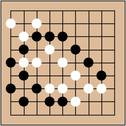
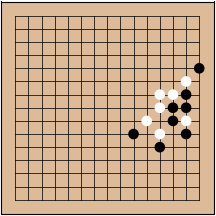
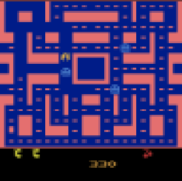
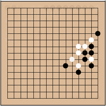
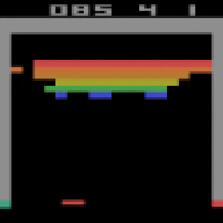
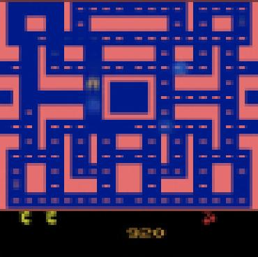
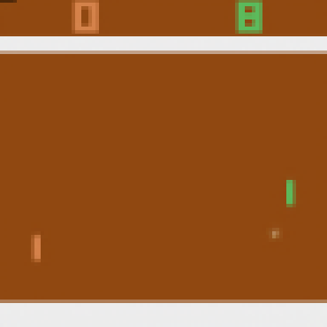
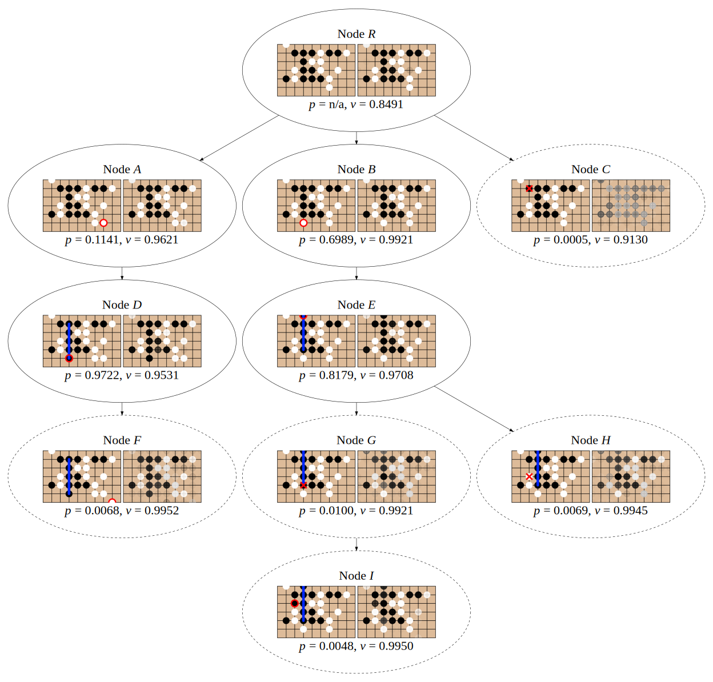

## Demystifying MuZero Planning: Interpreting the Learned Model

This is the official repository of the IEEE TAI paper "[Demystifying MuZero Planning: Interpreting the Learned Model](https://rlg.iis.sinica.edu.tw/papers/demystifying-muzero-planning)".

If you use this work for research, please consider citing our paper:
```
@article{guei2025demystifying,
  title={Demystifying MuZero Planning: Interpreting the Learned Model}, 
  author={Guei, Hung and Ju, Yan-Ru and Chen, Wei-Yu and Wu, Ti-Rong},
  journal={IEEE Transactions on Artificial Intelligence}, 
  year={2025},
  doi={10.1109/TAI.2025.3591082},
  publisher={IEEE}
}
```

This repository extends the [MiniZero](https://github.com/rlglab/minizero) framework to integrate MuZero with a *decoder network*, allowing reconstruction of hidden states into human-interpretable observations.
The decoder network performs well in our setup, as shown by the images below that compare the original and the reconstructed observations in five games.

|        | 9×9 Go | Gomoku | Breakout | Ms. Pacman | Pong |
| :----: | :----: | :----: | :------: | :--------: | :--: |
| original <br> observations |  |  |  |  |  |
| reconstructed <br> observations |  |  |  |  |  |

Visualizing the hidden states within the MuZero search tree offers a clearer understanding of how MuZero learns and plans.
For example, here is the Gomoku search tree for Black winning, revealing intriguing insights that MuZero is unfamiliar with invalid states (dashed ellipses) but still manages to maintain accurate values for them.



For more interesting findings, please refer to [our paper](https://doi.org/10.1109/TAI.2025.3591082).

The following sections will demonstrate how to train MuZero models with the decoder and use the models to examine unrolled hidden states and the MuZero search tree.

## Training MuZero with Decoder

First, clone this repository and enter the container using `scripts/start-container.sh`.

> [!NOTE]
> The code requires an Ubuntu system with [`docker`](https://www.docker.com/) or [`podman`](https://podman.io/) installed, it is recommended to have 24GB of GPU memory.
> The trained MuZero models used in the paper are available [here](https://rlg.iis.sinica.edu.tw/papers/demystifying-muzero-planning).

Standard script and configurations are provided to replicate the MuZero models with the decoder used in the paper.
For example, run
```bash
# for Go, use the config "cfg/go.cfg" to train the model for 300 iterations and store in folder "go_9x9_gmz"
scripts/train.sh go cfg/go.cfg go_9x9_gmz 300
```
<details>
<summary>Show the commands for all supported games.</summary>

* 9x9 Go: `scripts/train.sh go cfg/go.cfg go_9x9_gmz 300`
* Gomoku: `scripts/train.sh gomoku cfg/gomoku.cfg gomoku_oo_15x15_gmz 300`
* Breakout: `scripts/train.sh atari cfg/atari_breakout.cfg atari_breakout_gmz 300`
* Ms. Pacman: `scripts/train.sh atari cfg/atari_ms_pacman.cfg atari_ms_pacman_gmz 300`
* Pong: `scripts/train.sh atari cfg/atari_pong.cfg atari_pong_gmz 300`
  
</details>

> [!TIP]
> For more details and training hyperparameters, check out the [script](scripts/train.sh) and the [MiniZero docs](https://github.com/rlglab/minizero/blob/main/docs/Training.md).

Once the training is complete, taking Go as an example, a training folder named `go_9x9_gmz` will contain MuZero network models and training log files as follows.
* `model/`: a subfolder contains trained models of each iteration, e.g., `model/weight_iter_60000.pt`
* `sgf/`: a subfolder contains self-play records of each iteration, e.g., `sgf/300.sgf`
* `decoder/`: a subfolder contains the reconstructed observations during training
* `analysis/`: a subfolder contains the statistics during training
* `go_9x9_gmz.cfg`: the configuration file used for training
* `Training.log`, `Worker.log`, and `op.log`: the log files during training

<!-- ```
go_9x9_gmz
├── model                            # the MuZero models of each iteration
│   ├── weight_iter_200.pt           #   1st iteration
│   ├── weight_iter_400.pt           #   2nd iteration
│   ├── ...
│   └── weight_iter_60000.pt         #   300th iteration
├── sgf                              # the self-play records of each iteration
│   ├── 1.sgf                        #   1st iteration
│   ├── 2.sgf                        #   2nd iteration
│   ├── ...
│   └── 300.sgf                      #   300th iteration
├── decoder                          # the reconstructed observations during training
│   ├── visualization_1_200.png      #   1st iteration
│   ├── visualization_2_400.png      #   2nd iteration
│   ├── ...
│   └── visualization_300_60000.png  #   300th iteration
├── analysis                         # the statistics during training
├── go_9x9_gmz.cfg                   # the used configuration file
├── op.log                           # the log of network optimization
├── Training.log                     # the log of the main training process
└── Worker.log                       # the log of the worker components
``` -->

## Analyzing MuZero Unrolling

This analysis examines how a specific MuZero model performs within a given game record.
Across all time steps of the game, it produces the observations and reconstructed observations of unrolled hidden states.

Take the Go model `go_9x9_gmz` as an example, to analyze the model on the latest iteration, run
```bash
# for Go, use the config "cfg/go.cfg" and the model "go_9x9_gmz/model/weight_iter_60000.pt", read the first record in "go_9x9_gmz/sgf/300.sgf" and produce the results in folder "go_9x9_gmz/unroll_analysis"
scripts/analyze-unroll.sh go cfg/go.cfg go_9x9_gmz/model/weight_iter_60000.pt go_9x9_gmz/sgf/300.sgf go_9x9_gmz/unroll_analysis
```

The results will be stored in `go_9x9_gmz/unroll_analysis`, which contains four kinds of observation images:
> [!NOTE]
> Suppose the game has 105 moves, with observations $o_0, o_1, ..., o_{105}$ and actions $a_0, a_1, ..., a_{104}$.\
> We denote $h$, $g$, and $d$ as the representation, dynamics, and the decoder network, respectively.
* `observation_i.png`: observation $o_i$
* `representation_i.png`: reconstructed observation $d(h(o_i))$
* `dynamics_i.png`: reconstructed observation that unrolled from the initial, e.g.,
    - `dynamics_1.png`: reconstructed observation $d(g(h(o_0),a_0))$
    - `dynamics_2.png`: reconstructed observation $d(g(g(h(o_0),a_0),a_1))$
    - `dynamics_105.png`: reconstructed observation $d(g(g(...g(h(o_0),a_0)...,a_{103}),a_{104}))$
* `dynamics_k_i.png`: reconstructed observation that unrolled from $k = 5$ steps ago, e.g.,
    - `dynamics_k_5.png`: reconstructed observation $d(g(...g(h(o_0),a_0)...,a_4))$
    - `dynamics_k_6.png`: reconstructed observation $d(g(...g(h(o_1),a_1)...,a_5))$
    - `dynamics_k_105.png`: reconstructed observation $d(g(...g(h(o_{100}),a_{100})...,a_{104}))$

<!-- ```
go_9x9_gmz/unroll_analysis
├── observation_0.png           # observation: o_0
├── observation                 # observations: o_1 to o_105
│   ├── observation_1.png       #   o_1
│   ├── observation_2.png       #   o_2
│   ├── ...
│   └── observation_105.png     #   o_105 (terminal step)
├── representation_0.png        # reconstructed observation: d(h(o_0))
├── representation              # reconstructed observations (without unrolling):
│   ├── representation_1.png    #   from o_1: d(h(o_1))
│   ├── representation_2.png    #   from o_2: d(h(o_2))
│   ├── ...
│   └── representation_105.png  #   from o_105: d(h(o_105))
├── dynamics                    # reconstructed observations (unrolled from the initial):
│   ├── dynamics_1.png          #   unrolled 1 step: d(g(h(o_0),a_0))
│   ├── dynamics_2.png          #   unrolled 2 step: d(g(g(h(o_0),a_0),a_1))
│   ├── ...
│   └── dynamics_105.png        #   unrolled 105 step: d(g(g(...g(h(o_0),a_0)...,a_103),a_104))
└── dynamics_k                  # reconstructed observations (unrolled from k=5 steps ago):
    ├── dynamics_k_5.png        #   unrolled from h(o_0): d(g(...g(h(o_0),a_0)...,a_4))
    ├── dynamics_k_6.png        #   unrolled from h(o_1): d(g(...g(h(o_1),a_1)...,a_5))
    ├── ...
    └── dynamics_k_105.png      #   unrolled from h(o_100): d(g(...g(h(o_100),a_100)...,a_104))

# Note: o_t is the observation at time step t;
#       h, g, and d are the representation, dynamics, and the decoder network, respectively
``` -->

## Dumping MuZero Search Tree

The search tree provides information about the decision-making process for MuZero.
To play a game with the learned model, and dump all the search trees for each move, run

```bash
# for Go, use the config "cfg/go.cfg" and the model "go_9x9_gmz/model/weight_iter_60000.pt", run a self-play game with tree dump and store the dump files in folder "go_9x9_gmz/mcts_dump"
scripts/dump-mcts.sh go cfg/go.cfg go_9x9_gmz/model/weight_iter_60000.pt go_9x9_gmz/mcts_dump
```

The dump files are stored in `go_9x9_gmz/mcts_dump`, organized as follows.
* `selfplay.sgf` and `selfplay.log`: the self-play game record and log
* `tree_dump.txt`: the tree dump of each move
* `tree_dump/`: a subfolder contains images of the MCTS tree of each move, e.g.,
    - `tree_game0_move0.png`: the tree image of move0
    - `tree_game0_move1.png`: the tree image of move1
* `move_dump.txt`: the MCTS selection steps of each move
* `move_dump/`: a subfolder contains images of all MCTS selection steps (selected leaf nodes) of each move, e.g.,
    - `game0_move0_*_env.png`: the observations of selected leaf nodes in the tree of move0
    - `game0_move0_*_decoder.png`: the reconstructed observations of selected leaf nodes in the tree of move0
    - `game0_move1_*_env.png`: the observations of selected leaf nodes in the tree of move1
    - `game0_move1_*_decoder.png`: the reconstructed observations of selected leaf nodes in the tree of move1

<!-- ```
go_9x9_gmz/mcts_dump
├── selfplay.sgf                     # the self-play game record
├── selfplay.log                     # the self-play log
├── tree_dump.txt                    # the raw tree dump of each move
├── tree_dump                        # the images of the MCTS tree of each move
│   ├── tree_game0_move0.png         #   the tree of move0
│   ├── tree_game0_move1.png         #   the tree of move1
│   ├── ...
│   └── tree_game0_move102.png       #   the tree of move102
├── move_dump.txt                    # the raw MCTS simulation steps of each move
└── move_dump                        # the images of the MCTS simulation steps of each move
    ├── game0_move0_*_env.png        #   the observations of all simulation steps of move0
    ├── game0_move0_*_decoder.png    #   the reconstructed obs. of all simulation steps of move0
    ├── game0_move1_*_env.png        #   the observations of all simulation steps of move1
    ├── game0_move1_*_decoder.png    #   the reconstructed obs. of all simulation steps of move1
    ├── ...
    ├── game0_move102_*_env.png      #   the observations of all simulation steps of move102
    └── game0_move102_*_decoder.png  #   the reconstructed obs. of all simulation steps of move102
``` -->

